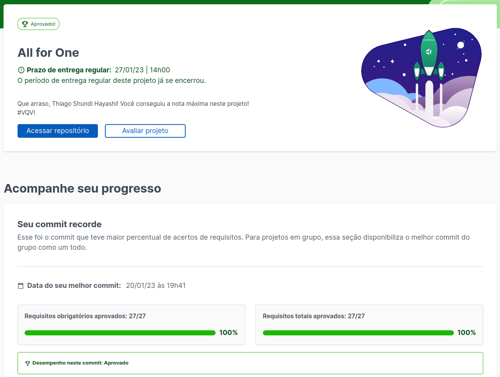

<h1> All for One </h1>

<h2> Sobre o projeto </h2>

 
Este projeto foi desenvolvido no curso de back-end, com a proposta de manipular, criar, extrair e transformar dados em contéudo util com o banco de dados SQL.

 

<h2> Avaliação do Projeto </h2>

<h2>Contato </h2>

 Para mais informações entre em contato: 

